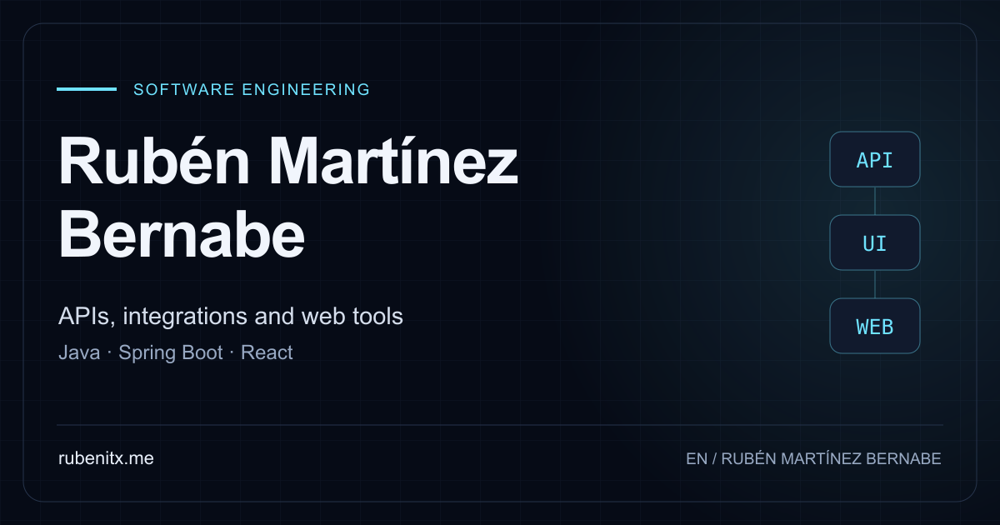
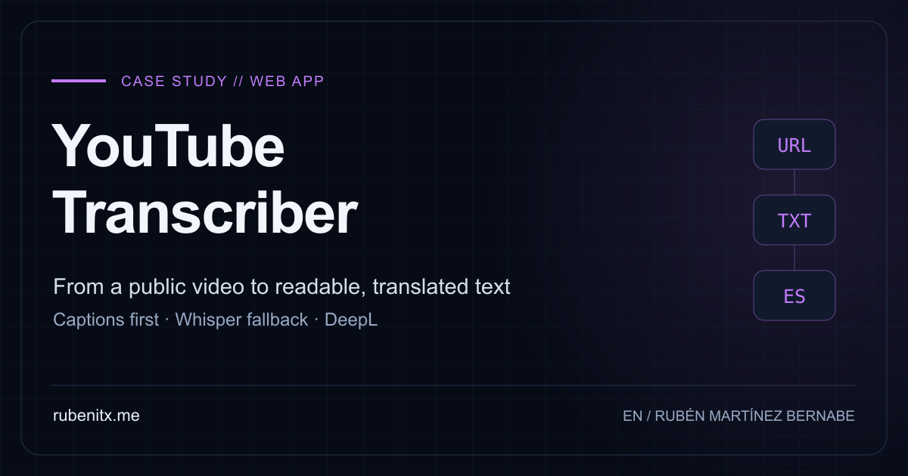
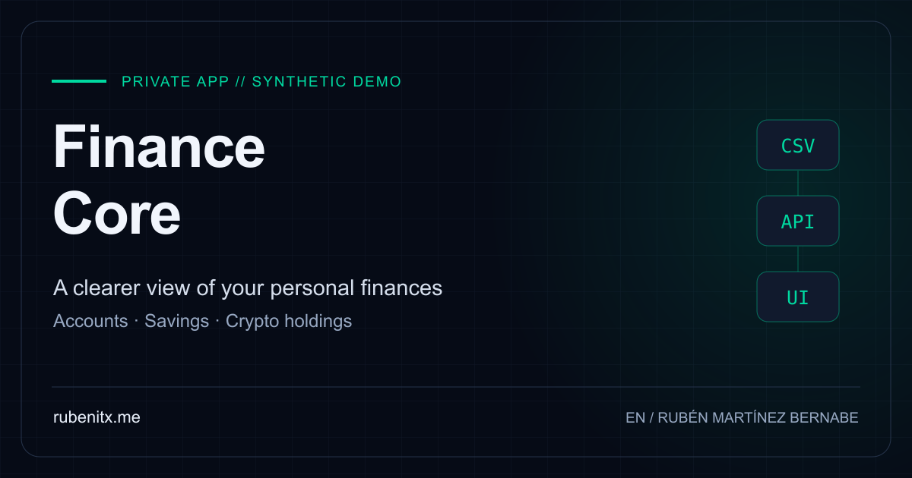
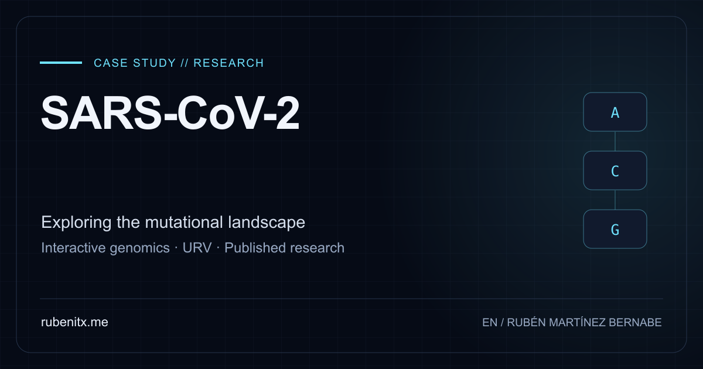
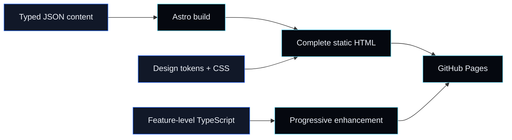

<div align="center">

<a href="https://rubenitx.me/">
  
</a>

<br>

<a href="https://rubenitx.me/">
  
</a>

<p>
  <a href="https://rubenitx.me/"><strong>ENTER PORTFOLIO</strong></a>
  &nbsp;·&nbsp;
  <a href="https://rubenitx.me/es/">ESPAÑOL</a>
  &nbsp;·&nbsp;
  <a href="https://rubenitx.me/cv/">CV</a>
  &nbsp;·&nbsp;
  <a href="https://github.com/rubenitx">GITHUB</a>
</p>

<p>
  
  
  
  
</p>

</div>

---

## Portfolio, engineered as a product

This repository powers **[rubenitx.me](https://rubenitx.me/)**, the bilingual
portfolio of **Rubén Martínez Bernabe**, a software engineer based in Barcelona.

It is not a collection of static profile cards. It is a complete product
experience built around one idea: **the document must work first; interaction
should make it memorable, never make it usable**.

Astro renders the complete site to semantic HTML. CSS creates its visual identity
and motion. Small TypeScript modules progressively add stateful interactions.
Remove JavaScript and the content, navigation, language routes and project stories
remain available.

> **Visual language:** deep ink surfaces, electric blue and cyan signals, editorial
> typography, technical diagrams and motion that responds to intent.

## Experience layer

### Killua // Godspeed

The hero turns an original Killua portrait into a live ASCII particle field.
Pointer movement disturbs the particles; reduced-motion users receive a stable,
fully readable composition.

### Work // real project stories

Experience is presented as an accessible tab system. Featured work uses cinematic
covers, focused actions and bilingual case studies with real demonstrations,
technical decisions, limitations and verification notes.

### Outside the code // interaction with purpose

A draggable 3D travel deck, a working HHKB typing trial with synthesized switch
audio, and a layered mechanical-keyboard archive bring personal interests into
the same design system.

### Game Mode // the DOM becomes the level

An optional platformer reads the actual page geometry as its world. Sections
become milestones, controls remain keyboard-accessible, and the feature loads only
when requested.

<details>
<summary><strong>Explore the interaction inventory</strong></summary>

<br>

- reactive ASCII portrait rendered on canvas
- orchestrated, finite entrance motion
- tabbed professional timeline
- touch and keyboard-friendly project carousel
- draggable 3D moment cards with throw physics
- interactive HHKB simulator, speed trial and switch profiles
- layered keyboard models with orbit and exploded views
- optional Killua platformer with synthesized audio
- bilingual routes with stable navigation context
- print-ready one-page CV in English and Spanish
- motion fallbacks for `prefers-reduced-motion`

</details>

## Selected work

### YouTube Transcriber

<a href="https://rubenitx.me/work/youtube-transcriber/">
  
</a>

A public YouTube URL becomes timestamped text that can be searched, translated
and exported. The captions-first pipeline uses `yt-dlp`, falls back to
`whisper.cpp`, and sends explicit processing stages to the Astro/React interface
from a Java/Spring Boot API.

[Read the case](https://rubenitx.me/work/youtube-transcriber/)
· [Open the app](https://yt.rubenitx.me/)
· [Frontend source](https://github.com/rubenitx/yt-transcriber-web)
· [API source](https://github.com/rubenitx/yt-transcriber-api)

### Finance Core

<a href="https://rubenitx.me/work/finance-core/">
  
</a>

A private personal-finance workspace connecting accounts, statement imports,
spending, budgets, savings goals and crypto holdings. The public case presents a
real local walkthrough against isolated synthetic data without exposing private
code, credentials or financial information.

[Read the case](https://rubenitx.me/work/finance-core/)
· `React / TypeScript`
· `FastAPI / Python`
· `PostgreSQL`

### The Mutational Landscape of SARS-CoV-2

<a href="https://rubenitx.me/work/sars-cov-2/">
  
</a>

An interactive research portal for exploring mutations across the SARS-CoV-2
genome, developed with Universitat Rovira i Virgili at the intersection of
software engineering, data visualization and bioinformatics.

[Read the case](https://rubenitx.me/work/sars-cov-2/)
· [Open the portal](http://sarscov2-mutation-portal.urv.cat/)
· [Read the publication](https://www.mdpi.com/1422-0067/24/10/9072)

## System design



The implementation follows a few strict boundaries:

- **One source of truth.** Typed content collections feed pages, CVs, metadata,
  structured data and localized routes.
- **Static by default.** Astro produces the complete document; there is no
  client-side framework runtime for the portfolio shell.
- **One module per behavior.** Carousels, contact flow, portrait, keyboard,
  cards and Game Mode boot independently.
- **One palette.** Components consume the shared ink, foreground, blue, cyan
  and status tokens rather than inventing local colors.
- **Bilingual parity.** English and Spanish are separate indexable URLs with
  matching actions, media and `hreflang` clusters.
- **Evidence over assumptions.** Verification runs against the generated site,
  where broken links, inaccessible controls and missing localized output are
  observable.

## Technology

<p>
  
  
  
  
  
</p>

**Interface** — Astro components, Tailwind CSS utilities, scoped CSS systems,
Archivo and JetBrains Mono.

**Content** — Astro Content Collections validated with Zod and localized through
typed dictionaries.

**Media** — `astro:assets`, responsive AVIF/WebP output, native on-demand video
and self-hosted audio.

**Delivery** — GitHub Actions and GitHub Pages behind the custom
`rubenitx.me` domain.

## Quality gates

The deployment checks the product as users receive it, not only its source files:

```text
type safety
    └── production build
          ├── static document and SEO assertions
          ├── interaction behavior against generated HTML
          ├── bilingual feature parity
          ├── media integrity and asset budgets
          └── deterministic game and motion rules
```

The gate also verifies no-JavaScript readability, canonical and `hreflang`
clusters, case-study media, accessible interaction states, image limits and
print-ready CV artifacts.

## Run locally

Requires **Node.js 22.6 or newer**.

```bash
git clone git@github.com:rubenitx/rubenitx.github.io.git
cd rubenitx.github.io
npm install
npm run dev
```

```bash
npm run check     # Astro and TypeScript diagnostics
npm run build     # Production output in dist/
npm run verify    # Assertions over the generated experience
npm test          # The complete CI gate
```

## Repository map

```text
.
├── public/                 # CVs, icons, social cards, demos and audio
├── scripts/                # Verification, media and artifact tooling
└── src/
    ├── assets/             # Images processed by Astro
    ├── components/
    │   ├── v2/             # Current portfolio experience
    │   ├── v1/             # Preserved previous version
    │   └── cv/             # Shared printable CV document
    ├── content/            # Typed bilingual source of truth
    ├── i18n/               # UI and domain terminology
    ├── integrations/       # Build-time asset pruning
    ├── pages/              # Portfolio, cases, CV and machine routes
    ├── scripts/            # Progressive enhancement by feature
    └── styles/             # Tokens and scoped visual systems
```

## Routes

- [Portfolio — English](https://rubenitx.me/)
- [Portfolio — Español](https://rubenitx.me/es/)
- [Developer CV](https://rubenitx.me/cv/)
- [Previous portfolio version](https://rubenitx.me/v1/)
- [GitHub profile](https://github.com/rubenitx)
- [LinkedIn](https://www.linkedin.com/in/rubenmartinezbernabe/)

---

<div align="center">

<sub>Designed and engineered in Barcelona · static HTML, electric details</sub>

<br>

<a href="https://rubenitx.me/"><strong>rubenitx.me</strong></a>

</div>
